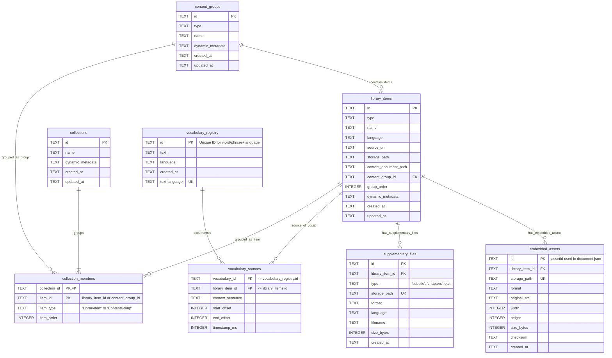

# `metadata.sqlite` File Overview

> [!Note] Description
> The core application SQLite database file residing directly in the `.faseeh` root. It stores all **metadata** about the user's library, imported content (`MediaObjects`), `LanguageUnits`, `Collections`, `MediaGroups`, user progress, SRS data, and potentially other structured application data. It explicitly **does not** store the large binary media files themselves (which are in `library/`).

## Key Notes

> [!Summary]+ Content:
> - A standard SQLite database file.
> - Contains tables for `MediaObjects`, `LanguageUnits`, `Collections`, `MediaGroups`, etc., and their relationships.
> ---
> - **Managed By:** [[Storage Service]] (Main Process). This service has exclusive control over reading from and writing to this database file.
> ---
> - **Access:** All access from the Renderer process (UI, Plugins, Services) **must** go through the [[Storage Api|Preload Storage API]] via IPC, which then interacts with the [[Storage Service]]. Direct file access is forbidden to ensure data integrity.

> [!Tip] Importance:
> This is one of the most critical parts of the user's data. Corruption here can lead to loss of organization and metadata for the entire library. It should be included in any backup strategy.

## Schema

```sql
-- Recommended PRAGMAs for performance and integrity
PRAGMA journal_mode = WAL;
PRAGMA foreign_keys = ON;

-- ==========================================================
-- Library Structure & Content Metadata
-- ==========================================================

CREATE TABLE IF NOT EXISTS library_items (
    id TEXT PRIMARY KEY NOT NULL,           -- UUID: Unique identifier for this library item.
    type TEXT NOT NULL,                     -- TEXT: Type of content (e.g., 'Video', 'Article', 'BookChapter'). Used for filtering and adapter selection.
    name TEXT,                              -- TEXT: User-editable name or title of the item.
    language TEXT,                          -- TEXT: ISO 639 language code (e.g., 'en', 'es'). Primary language of the item.
    source_uri TEXT,                        -- TEXT: Original source URI (file path or URL) before import. Nullable (e.g., for pasted text).
    storage_path TEXT,                      -- TEXT: Relative path to the main source file within '.faseeh/library/{id}/' (e.g., 'source.mp4'), if copied internally. Nullable.
    content_document_path TEXT,             -- TEXT: Relative path to the structured content JSON file within '.faseeh/library/{id}/' (e.g., 'document.json'). Nullable.
    content_group_id TEXT,                  -- TEXT: Foreign Key linking to content_groups.id if this item belongs to a group (e.g., book chapter -> book). Nullable.
    group_order INTEGER,                    -- INTEGER: Positional order of this item within its content_group. Nullable.
    dynamic_metadata TEXT DEFAULT '{}',     -- TEXT: JSON blob for flexible storage of type-specific metadata (duration, author, resolution) and user/plugin custom fields (tags, etc.).
    created_at TEXT NOT NULL DEFAULT CURRENT_TIMESTAMP, -- TEXT: ISO 8601 timestamp of creation.
    updated_at TEXT NOT NULL DEFAULT CURRENT_TIMESTAMP, -- TEXT: ISO 8601 timestamp of last update (managed by trigger).

    FOREIGN KEY (content_group_id) REFERENCES content_groups(id) ON DELETE SET NULL -- If group deleted, item remains but loses group link.
);
-- Indices for common lookups
CREATE INDEX idx_library_items_type ON library_items(type);
CREATE INDEX idx_library_items_language ON library_items(language);
CREATE INDEX idx_library_items_content_group_id ON library_items(content_group_id);
CREATE INDEX idx_library_items_created_at ON library_items(created_at);

-- Trigger to update 'updated_at' timestamp automatically
CREATE TRIGGER trg_library_items_updated_at AFTER UPDATE ON library_items
BEGIN
    UPDATE library_items SET updated_at = CURRENT_TIMESTAMP WHERE id = old.id;
END;


CREATE TABLE IF NOT EXISTS content_groups (
    id TEXT PRIMARY KEY NOT NULL,           -- UUID: Unique identifier for this content group.
    type TEXT NOT NULL,                     -- TEXT: Type of group (e.g., 'Book', 'Series', 'Album').
    name TEXT NOT NULL,                     -- TEXT: Name of the group (e.g., Book Title, Series Name).
    dynamic_metadata TEXT DEFAULT '{}',     -- TEXT: JSON blob for group-specific metadata (ISBN, season number, description, etc.).
    created_at TEXT NOT NULL DEFAULT CURRENT_TIMESTAMP,
    updated_at TEXT NOT NULL DEFAULT CURRENT_TIMESTAMP
);
-- Indices for common lookups
CREATE INDEX idx_content_groups_type ON content_groups(type);
CREATE INDEX idx_content_groups_name ON content_groups(name);

-- Trigger for updates
CREATE TRIGGER trg_content_groups_updated_at AFTER UPDATE ON content_groups
BEGIN
    UPDATE content_groups SET updated_at = CURRENT_TIMESTAMP WHERE id = old.id;
END;


CREATE TABLE IF NOT EXISTS collections (
    id TEXT PRIMARY KEY NOT NULL,           -- UUID: Unique identifier for this user-defined collection.
    name TEXT NOT NULL,                     -- TEXT: Name given by the user to this collection.
    dynamic_metadata TEXT DEFAULT '{}',     -- TEXT: JSON blob for user notes, description, sorting preferences etc.
    created_at TEXT NOT NULL DEFAULT CURRENT_TIMESTAMP,
    updated_at TEXT NOT NULL DEFAULT CURRENT_TIMESTAMP
);
-- Index for lookup by name
CREATE INDEX idx_collections_name ON collections(name);

-- Trigger for updates
CREATE TRIGGER trg_collections_updated_at AFTER UPDATE ON collections
BEGIN
    UPDATE collections SET updated_at = CURRENT_TIMESTAMP WHERE id = old.id;
END;


-- Linking table for Collections (Many-to-Many relationship)
CREATE TABLE IF NOT EXISTS collection_members (
    collection_id TEXT NOT NULL,            -- TEXT: Foreign Key linking to collections.id.
    item_id TEXT NOT NULL,                  -- TEXT: ID of the item in the collection (can be a library_items.id OR content_groups.id).
    item_type TEXT NOT NULL,                -- TEXT: Discriminator ('LibraryItem' or 'ContentGroup') to indicate which table item_id refers to.
    item_order INTEGER NOT NULL,            -- INTEGER: User-defined display order of this item within the collection.

    PRIMARY KEY (collection_id, item_id), -- Composite key prevents duplicates within a collection.
    FOREIGN KEY (collection_id) REFERENCES collections(id) ON DELETE CASCADE -- If collection deleted, membership links are removed.
    -- Cannot add DB-level FK for item_id due to polymorphism; must be enforced by application logic.
);
-- Indices for querying memberships
CREATE INDEX idx_collection_members_collection_id ON collection_members(collection_id);
CREATE INDEX idx_collection_members_item_id ON collection_members(item_id); -- Find which collections an item belongs to.

-- ==========================================================
-- Minimal Vocabulary Registry & Context
-- ==========================================================

CREATE TABLE IF NOT EXISTS vocabulary_registry (
    id TEXT PRIMARY KEY NOT NULL,           -- UUID: Unique ID assigned to a specific word/phrase in a specific language. Used for linking across DBs/plugins.
    text TEXT NOT NULL,                     -- TEXT: The actual word or phrase string.
    language TEXT NOT NULL,                 -- TEXT: ISO 639 language code.
    created_at TEXT NOT NULL DEFAULT CURRENT_TIMESTAMP,

    UNIQUE (text, language)                 -- Ensures only one ID exists for the exact same word/phrase in the same language.
);
-- Indices for efficient lookup
CREATE INDEX idx_vocabulary_registry_text_language ON vocabulary_registry(text, language);
CREATE INDEX idx_vocabulary_registry_language ON vocabulary_registry(language);


-- Linking table: Where was this vocabulary item encountered?
CREATE TABLE IF NOT EXISTS vocabulary_sources (
    vocabulary_id TEXT NOT NULL,            -- TEXT: Foreign Key linking to vocabulary_registry.id.
    library_item_id TEXT NOT NULL,          -- TEXT: Foreign Key linking to the library_items.id where this vocabulary was found.
    -- Optional fields providing context within the library item:
    context_sentence TEXT,                  -- TEXT: The full sentence containing the vocabulary item (can be large, consider storing offsets instead).
    start_offset INTEGER,                   -- INTEGER: Character start index within the item's text content.
    end_offset INTEGER,                     -- INTEGER: Character end index within the item's text content.
    timestamp_ms INTEGER,                   -- INTEGER: Start time in milliseconds (for audio/video context).

    -- No primary key; allows multiple occurrences of the same word in the same item.
    FOREIGN KEY (vocabulary_id) REFERENCES vocabulary_registry(id) ON DELETE CASCADE, -- If vocab deleted, remove occurrences.
    FOREIGN KEY (library_item_id) REFERENCES library_items(id) ON DELETE CASCADE    -- If item deleted, remove occurrences.
);
-- Indices for finding occurrences
CREATE INDEX idx_vocabulary_sources_vocabulary_id ON vocabulary_sources(vocabulary_id); -- Find all places a word appears.
CREATE INDEX idx_vocabulary_sources_library_item_id ON vocabulary_sources(library_item_id); -- Find all words in an item.
CREATE INDEX idx_vocabulary_sources_library_item_id_timestamp ON vocabulary_sources(library_item_id, timestamp_ms); -- For time-based lookups.

-- ==========================================================
-- File Tracking Tables (Indexing files in library/{id}/...)
-- ==========================================================

CREATE TABLE IF NOT EXISTS embedded_assets (
    id TEXT PRIMARY KEY NOT NULL,           -- UUID: Unique ID for this asset (matches assetId in document.json).
    library_item_id TEXT NOT NULL,          -- TEXT: Foreign Key linking to the library_items.id this asset belongs to.
    storage_path TEXT NOT NULL UNIQUE,      -- TEXT: **Relative** path within '.faseeh/library/{library_item_id}/assets/'. Must be unique across all assets.
    format TEXT,                            -- TEXT: File format/extension (e.g., 'jpeg', 'png').
    original_src TEXT,                      -- TEXT: Original source URL if downloaded. Nullable.
    width INTEGER,                          -- INTEGER: Image width in pixels. Nullable.
    height INTEGER,                         -- INTEGER: Image height in pixels. Nullable.
    size_bytes INTEGER,                     -- INTEGER: Size of the asset file in bytes. Nullable.
    checksum TEXT,                          -- TEXT: SHA-256 or other hash for integrity checking. Nullable.
    created_at TEXT NOT NULL DEFAULT CURRENT_TIMESTAMP,

    FOREIGN KEY (library_item_id) REFERENCES library_items(id) ON DELETE CASCADE -- If library item deleted, its assets are removed from index.
);
-- Index for finding assets of an item
CREATE INDEX idx_embedded_assets_library_item_id ON embedded_assets(library_item_id);


CREATE TABLE IF NOT EXISTS supplementary_files (
    id TEXT PRIMARY KEY NOT NULL,           -- UUID: Unique ID for this supplementary file record.
    library_item_id TEXT NOT NULL,          -- TEXT: Foreign Key linking to the library_items.id this file belongs to.
    type TEXT NOT NULL,                     -- TEXT: Functional type (e.g., 'subtitle', 'chapters', 'transcript', 'metadata'). Standardized list preferred.
    storage_path TEXT NOT NULL UNIQUE,      -- TEXT: **Relative** path within '.faseeh/library/{library_item_id}/associated/'. Must be unique.
    format TEXT,                            -- TEXT: File format/extension (e.g., 'srt', 'vtt', 'json'). Nullable.
    language TEXT,                          -- TEXT: ISO 639 language code, if applicable (especially for subtitles/transcripts). Nullable.
    filename TEXT,                          -- TEXT: Original or suggested filename. Nullable.
    size_bytes INTEGER,                     -- INTEGER: Size of the file in bytes. Nullable.
    checksum TEXT,                          -- TEXT: SHA-256 or other hash for integrity checking. Nullable.
    created_at TEXT NOT NULL DEFAULT CURRENT_TIMESTAMP,

    FOREIGN KEY (library_item_id) REFERENCES library_items(id) ON DELETE CASCADE -- If library item deleted, its supplementary files are removed from index.
);
-- Indices for finding specific supplementary files
CREATE INDEX idx_supplementary_files_library_item_id ON supplementary_files(library_item_id);
CREATE INDEX idx_supplementary_files_type ON supplementary_files(type);
CREATE INDEX idx_supplementary_files_language ON supplementary_files(language);

```


