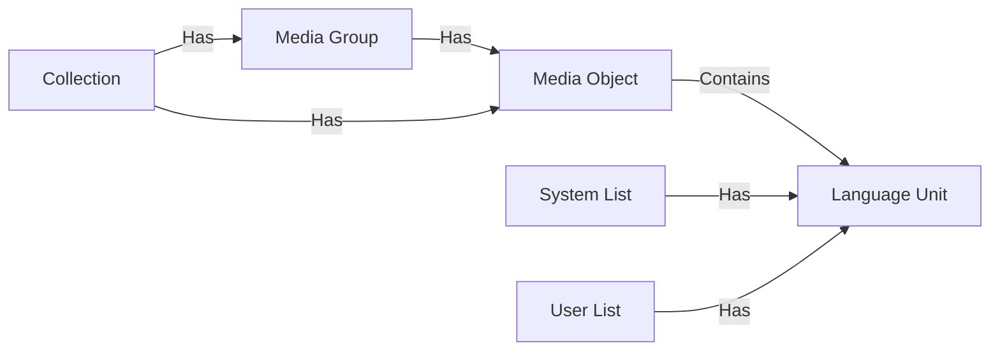

#LOGIC 

---
##### Structure
- Each imported media is represented as `Media Object`, this might be a video, an article, a podcast episode, etc.
- `Media Objects` that might be related to each like episodes of a serie, chapters of a book, etc. are grouped together in `Media Groups`.
- `Media Objects` and `Media Groups` can be grouped together in `Collections`, which are user-defined groups of unrelated media but that are grouped together for a specific purpose, like topics.
- `Language Units` are the words, phrases, idioms, etc. they can be extracted from the `Media Objects` and be presented in multiple `Media Objects`.
- `Language Units` are grouped together in `Lists`, which are system or user-defined groups of language units. 

> Note: This isn't necessarily how it should be implemented, it can be simplified by creating a group that contain objects and also groups. so we ends up only with `Media Object` and `Group`.

##### Metadata
- These Data structure might hold metadata that can be used for various purposes.
- These Meta data should be a mix between static and dynamic data.
- Static data are data that are mandatory across all media objects, and are used for data integrity: `type`, `id`, `name`, `created_at`, `updated_at`, `language`, etc.
- Dynamic data are data that should be stored as json objects, and might be mandatory depending on the type of media object, UI, tools, etc.
	- videos for example might have `duration`, `resolution`, `url`, `thumbnail`, etc.
	- subtitle generation tool might inject metadata like `subtitles`, `ai_model`, `ai_model_version`, etc.
- Dynamic metadata can provide a lot of flexibility, for example :
	- Allowing the user to add their own metadata to the media object for further sorting and filtering options.
	- Providing an api for the community to create their own metadata and use them in their own tools.